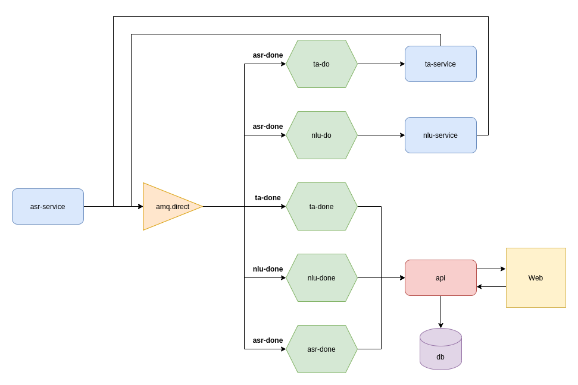

# Microsserviços para Transcrição
Repositório criado para salvar os códigos de um projeto utilizando arquitetura de microsserviços, com NestJS e RabbitMQ.

## Considerações
A intenção principal desse projeto é ver como configurar os microsserviços como consumers ou providers utilizando\
o sistema de mensageria do RabbitMQ. A funcionalidade de cada um não está realmente implementada, ou seja, os dados\
retornados por cada um dos microsserviços são forjados. Mesmo assim, acredito que desenvolver esse projeto proporcionou\
um ganho de conhecimento gigantesco e que me fez ficar ainda mais fascinado pelo assunto. 😄

## Fluxograma
  
Inicialmente é feita uma requisição para o `asr-service`, essa requisição deveria enviar um arquivo de áudio para ser\
transcrito, mas como o objetivo aqui não é implementar de fato os serviços, está sendo enviado diretamente um texto.\
Com isso, esse microsserviço envia uma mensagem para uma **exchange**, com a **routing key**  `asr-done`. Essa exchange\
publica entao a mensagem em três outras **queues**, `asr-done`, `nlu-do` e `ta-do`.\
 - Na fila `asr-done`, a `api`, recebe a mensagem e faz o cadastro daquela transcrição no banco de dados. 
 - Na fila `nlu-do`, o `nlu-service`, teoricamente faria o serviço de Natural Language Understanding e envia o resultado\
para a fila de `nlu-done`.
 - Na fila de `ta-do`, o `ta-service`, teoricamente faria o serviço de Tone Analyze e evia o resultado para a fila\
de `ta-done`.
 - Nas filas de `nlu-done` e `ta-done`, a `api`, consome as mensagens e atualiza os registros no banco adicionando as\
informações de NLU e TA, para que uma aplicação web possa fazer uma requisição e ter todas as informações.
